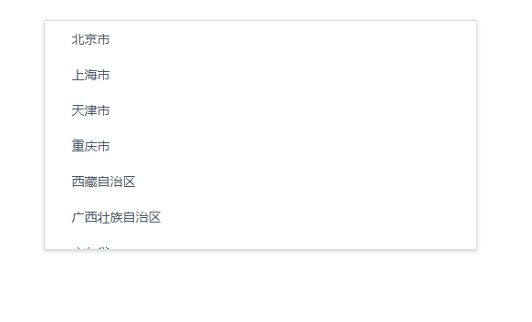

# react-sam-scrollbar

Handle element scroll like Mobile phone scrollViewBar

## Demo



```
git clone https://github.com/Sammiu/react-sam-scrollbar.git
cd react-sam-scrollbar
npm i && npm run examples
```

## Installation

```
npm i react-sam-scrollbar
// OR
yarn add react-sam-scrollbar
```

## Examples

#### 1. Render prop pattern

```jsx
import ScrollBar from 'react-sam-scrollbar'

     <div>
       <ScrollBar disableHorizontal={true}>
           <ul className="select-dropdown_list">
              {data && data.map(item => (
                 <li key={item.id}><span className="select-dropdown_item_text">{item.name}</span></li>))}
                    </ul>
        </ScrollBar>
      </div>
```
## API

| Prop           | Type        | Description                                           | Default     |
 | --------------------- | ----------------- | ------------------------------------------------------------------------------------------------------------------------------------------------------------------------------------------------------------------------------------------------------------------------------------------------------------------------ | ----------- |
| onScroll          | function     | Callback event when scrolling                                                        | `-----`     |
| noResize          | Bool         | If the container size does not change, it is best to set it to optimize performance  | `true`     |
| maxHeight         | number       | the maximum height of the rolling container                                          | `250px`     |
| disableVertical   | Bool         | Disable vertical scroll bar                                                          | `false`     |
| disableHorizontal | Bool         | Disable horizontal scroll bar                                                        | `false`     |
